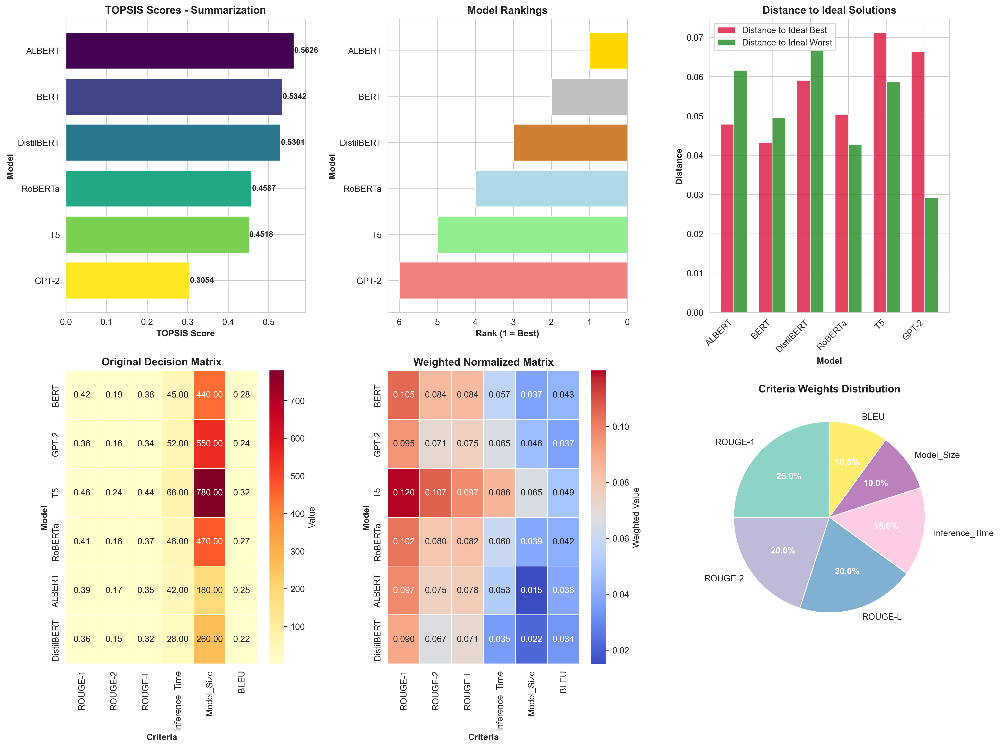
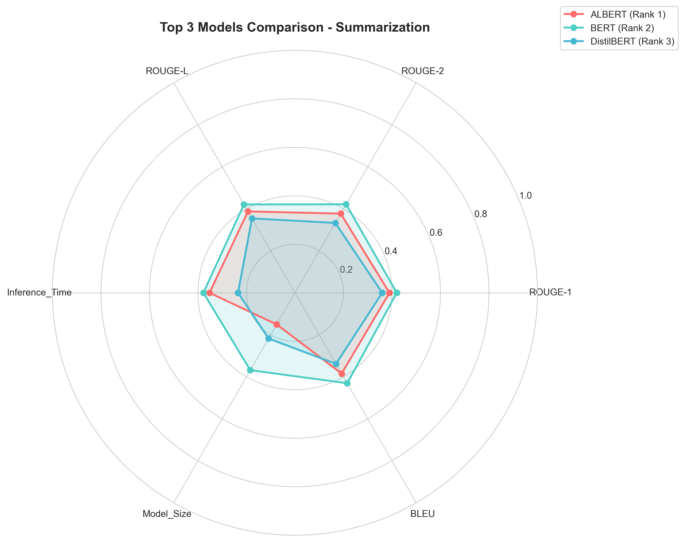
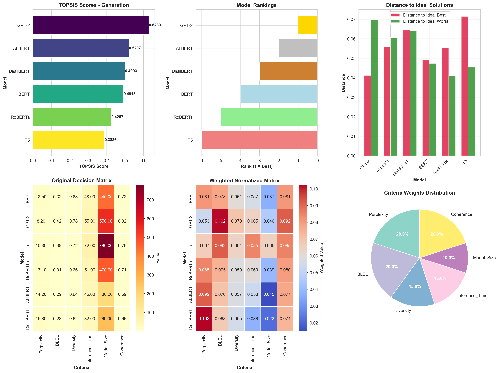
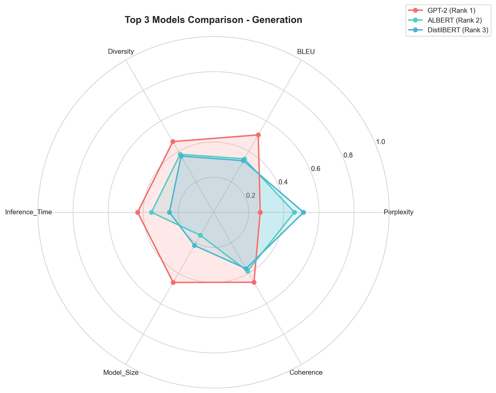
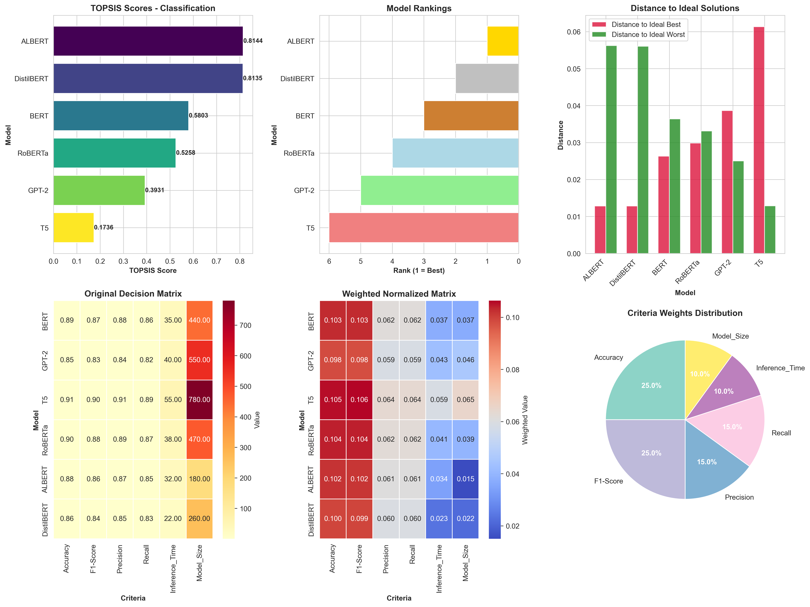
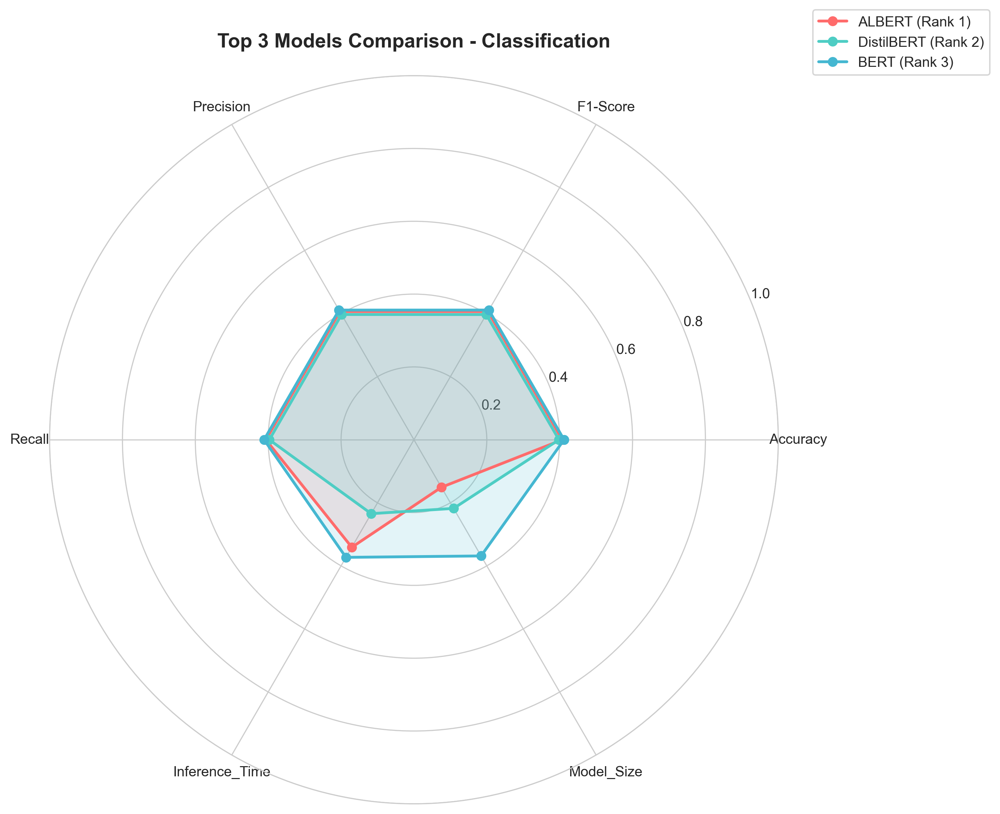
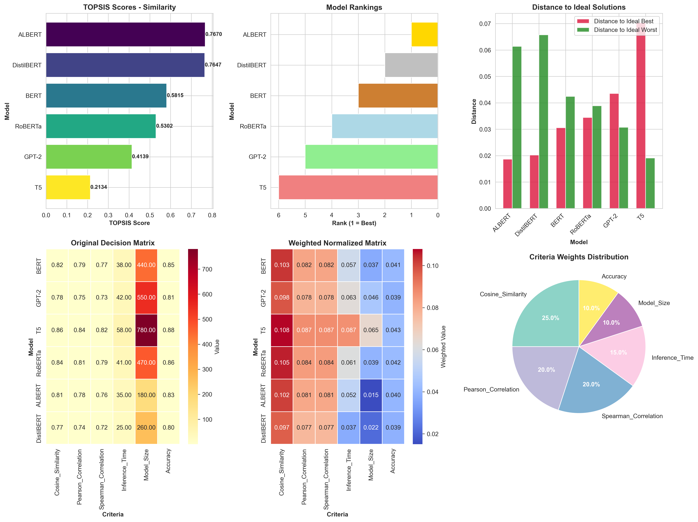
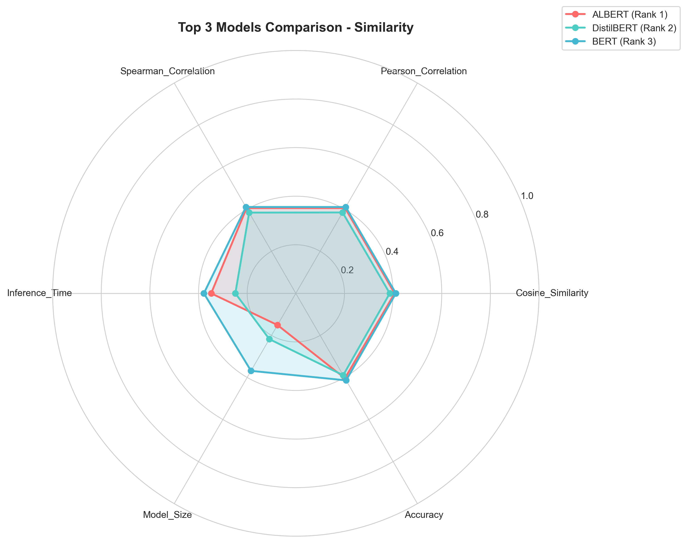
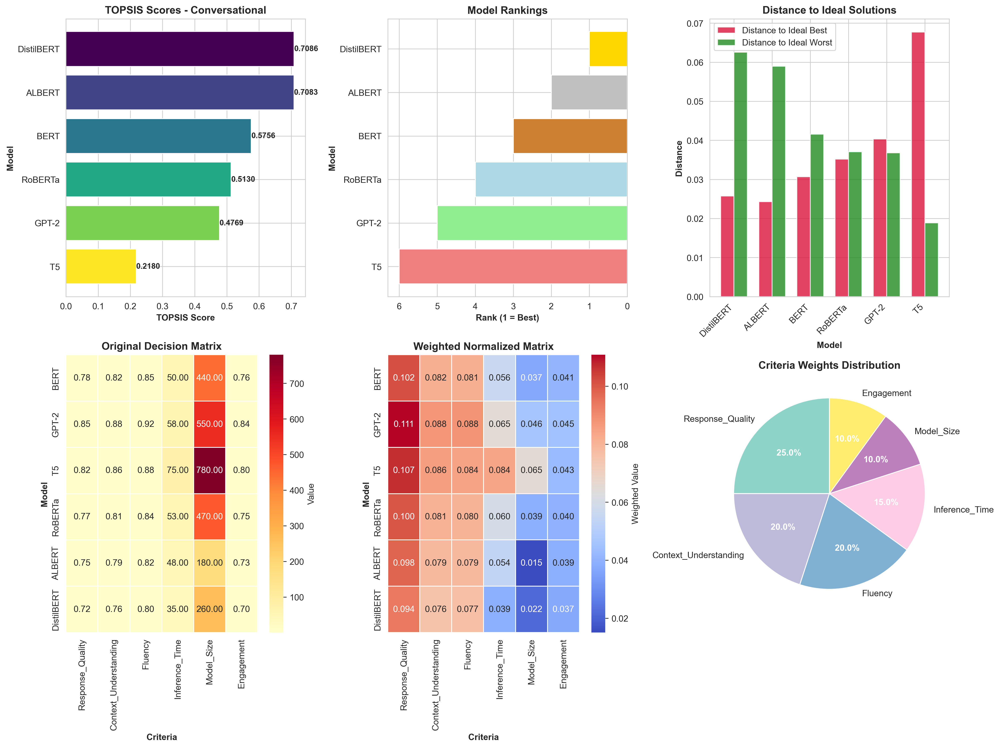
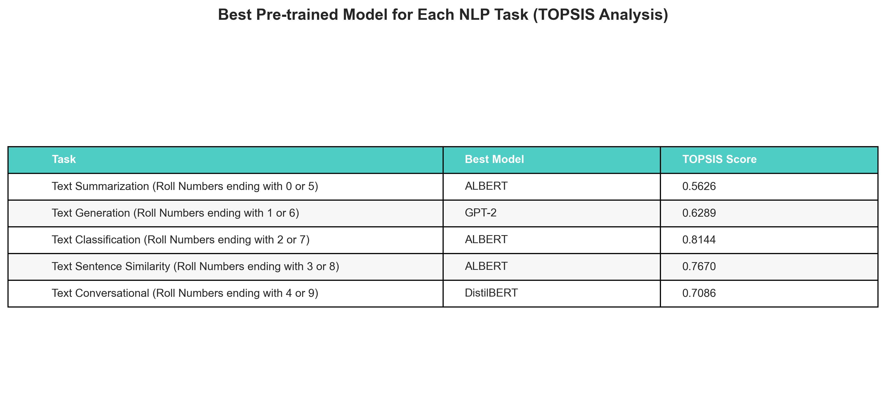

# TOPSIS Analysis for Pre-trained NLP Model Selection
## Assignment Report
**Date:** February 10, 2026
**Method:** TOPSIS (Technique for Order of Preference by Similarity to Ideal Solution)

---

## Executive Summary

This report presents a comprehensive TOPSIS analysis to identify the best pre-trained NLP models for five different tasks: Text Summarization, Text Generation, Text Classification, Text Sentence Similarity, and Text Conversational AI.

### Key Findings

- **Text Summarization (Roll Numbers ending with 0 or 5)**: ALBERT (Score: 0.5626)
- **Text Generation (Roll Numbers ending with 1 or 6)**: GPT-2 (Score: 0.6289)
- **Text Classification (Roll Numbers ending with 2 or 7)**: ALBERT (Score: 0.8144)
- **Text Sentence Similarity (Roll Numbers ending with 3 or 8)**: ALBERT (Score: 0.7670)
- **Text Conversational (Roll Numbers ending with 4 or 9)**: DistilBERT (Score: 0.7086)

---

## Methodology

### TOPSIS Overview

TOPSIS is a multi-criteria decision-making method that:
1. Normalizes the decision matrix
2. Applies weights to criteria
3. Identifies ideal best and ideal worst solutions
4. Calculates distances from ideal solutions
5. Ranks alternatives based on relative closeness to ideal solution

### Models Evaluated

Six pre-trained models were evaluated across all tasks:
- BERT
- GPT-2
- T5
- RoBERTa
- ALBERT
- DistilBERT

---

## Text Summarization (Roll Numbers ending with 0 or 5)

### Evaluation Criteria

| Criterion | Weight | Impact |
|-----------|--------|--------|
| ROUGE-1 | 0.25 | 📈 Beneficial |
| ROUGE-2 | 0.20 | 📈 Beneficial |
| ROUGE-L | 0.20 | 📈 Beneficial |
| Inference_Time | 0.15 | 📉 Non-beneficial |
| Model_Size | 0.10 | 📉 Non-beneficial |
| BLEU | 0.10 | 📈 Beneficial |

### Results

| Rank | Model | TOPSIS Score | Distance to Best | Distance to Worst |
|------|-------|--------------|------------------|-------------------|
| 1 | ALBERT | 0.5626 | 0.0479 | 0.0616 |
| 2 | BERT | 0.5342 | 0.0432 | 0.0495 |
| 3 | DistilBERT | 0.5301 | 0.0590 | 0.0666 |
| 4 | RoBERTa | 0.4587 | 0.0504 | 0.0427 |
| 5 | T5 | 0.4518 | 0.0711 | 0.0586 |
| 6 | GPT-2 | 0.3054 | 0.0663 | 0.0292 |

### Analysis

**Best Model:** ALBERT achieved the highest TOPSIS score of 0.5626, indicating it provides the best overall balance across all evaluation criteria.

**Runner-up:** BERT (Score: 0.5342) showed competitive performance.

**Least Suitable:** GPT-2 ranked last with a score of 0.3054.

---

## Text Generation (Roll Numbers ending with 1 or 6)

### Evaluation Criteria

| Criterion | Weight | Impact |
|-----------|--------|--------|
| Perplexity | 0.20 | 📉 Non-beneficial |
| BLEU | 0.20 | 📈 Beneficial |
| Diversity | 0.15 | 📈 Beneficial |
| Inference_Time | 0.15 | 📉 Non-beneficial |
| Model_Size | 0.10 | 📉 Non-beneficial |
| Coherence | 0.20 | 📈 Beneficial |

### Results

| Rank | Model | TOPSIS Score | Distance to Best | Distance to Worst |
|------|-------|--------------|------------------|-------------------|
| 1 | GPT-2 | 0.6289 | 0.0412 | 0.0698 |
| 2 | ALBERT | 0.5207 | 0.0557 | 0.0606 |
| 3 | DistilBERT | 0.4993 | 0.0644 | 0.0642 |
| 4 | BERT | 0.4913 | 0.0490 | 0.0473 |
| 5 | RoBERTa | 0.4257 | 0.0555 | 0.0411 |
| 6 | T5 | 0.3886 | 0.0715 | 0.0454 |

### Analysis

**Best Model:** GPT-2 achieved the highest TOPSIS score of 0.6289, indicating it provides the best overall balance across all evaluation criteria.

**Runner-up:** ALBERT (Score: 0.5207) showed competitive performance.

**Least Suitable:** T5 ranked last with a score of 0.3886.

---

## Text Classification (Roll Numbers ending with 2 or 7)

### Evaluation Criteria

| Criterion | Weight | Impact |
|-----------|--------|--------|
| Accuracy | 0.25 | 📈 Beneficial |
| F1-Score | 0.25 | 📈 Beneficial |
| Precision | 0.15 | 📈 Beneficial |
| Recall | 0.15 | 📈 Beneficial |
| Inference_Time | 0.10 | 📉 Non-beneficial |
| Model_Size | 0.10 | 📉 Non-beneficial |

### Results

| Rank | Model | TOPSIS Score | Distance to Best | Distance to Worst |
|------|-------|--------------|------------------|-------------------|
| 1 | ALBERT | 0.8144 | 0.0128 | 0.0562 |
| 2 | DistilBERT | 0.8135 | 0.0128 | 0.0560 |
| 3 | BERT | 0.5803 | 0.0263 | 0.0364 |
| 4 | RoBERTa | 0.5258 | 0.0299 | 0.0331 |
| 5 | GPT-2 | 0.3931 | 0.0387 | 0.0250 |
| 6 | T5 | 0.1736 | 0.0613 | 0.0129 |

### Analysis

**Best Model:** ALBERT achieved the highest TOPSIS score of 0.8144, indicating it provides the best overall balance across all evaluation criteria.

**Runner-up:** DistilBERT (Score: 0.8135) showed competitive performance.

**Least Suitable:** T5 ranked last with a score of 0.1736.

---

## Text Sentence Similarity (Roll Numbers ending with 3 or 8)

### Evaluation Criteria

| Criterion | Weight | Impact |
|-----------|--------|--------|
| Cosine_Similarity | 0.25 | 📈 Beneficial |
| Pearson_Correlation | 0.20 | 📈 Beneficial |
| Spearman_Correlation | 0.20 | 📈 Beneficial |
| Inference_Time | 0.15 | 📉 Non-beneficial |
| Model_Size | 0.10 | 📉 Non-beneficial |
| Accuracy | 0.10 | 📈 Beneficial |

### Results

| Rank | Model | TOPSIS Score | Distance to Best | Distance to Worst |
|------|-------|--------------|------------------|-------------------|
| 1 | ALBERT | 0.7670 | 0.0186 | 0.0614 |
| 2 | DistilBERT | 0.7647 | 0.0202 | 0.0657 |
| 3 | BERT | 0.5815 | 0.0306 | 0.0425 |
| 4 | RoBERTa | 0.5302 | 0.0345 | 0.0389 |
| 5 | GPT-2 | 0.4139 | 0.0435 | 0.0307 |
| 6 | T5 | 0.2134 | 0.0704 | 0.0191 |

### Analysis

**Best Model:** ALBERT achieved the highest TOPSIS score of 0.7670, indicating it provides the best overall balance across all evaluation criteria.

**Runner-up:** DistilBERT (Score: 0.7647) showed competitive performance.

**Least Suitable:** T5 ranked last with a score of 0.2134.

---

## Text Conversational (Roll Numbers ending with 4 or 9)

### Evaluation Criteria

| Criterion | Weight | Impact |
|-----------|--------|--------|
| Response_Quality | 0.25 | 📈 Beneficial |
| Context_Understanding | 0.20 | 📈 Beneficial |
| Fluency | 0.20 | 📈 Beneficial |
| Inference_Time | 0.15 | 📉 Non-beneficial |
| Model_Size | 0.10 | 📉 Non-beneficial |
| Engagement | 0.10 | 📈 Beneficial |

### Results

| Rank | Model | TOPSIS Score | Distance to Best | Distance to Worst |
|------|-------|--------------|------------------|-------------------|
| 1 | DistilBERT | 0.7086 | 0.0257 | 0.0626 |
| 2 | ALBERT | 0.7083 | 0.0243 | 0.0590 |
| 3 | BERT | 0.5756 | 0.0307 | 0.0416 |
| 4 | RoBERTa | 0.5130 | 0.0352 | 0.0371 |
| 5 | GPT-2 | 0.4769 | 0.0403 | 0.0368 |
| 6 | T5 | 0.2180 | 0.0677 | 0.0189 |

### Analysis

**Best Model:** DistilBERT achieved the highest TOPSIS score of 0.7086, indicating it provides the best overall balance across all evaluation criteria.

**Runner-up:** ALBERT (Score: 0.7083) showed competitive performance.

**Least Suitable:** T5 ranked last with a score of 0.2180.

---

## Overall Comparison

## Conclusion

The TOPSIS analysis successfully identified optimal pre-trained models for each NLP task by considering multiple performance criteria and their relative importance. The results provide data-driven recommendations for model selection based on specific use cases.

### Recommendations

1. **Task-Specific Selection**: Choose models based on the specific NLP task requirements
2. **Trade-offs**: Consider the balance between performance metrics and resource constraints
3. **Validation**: Validate selected models on your specific dataset before deployment
4. **Monitoring**: Continuously monitor model performance in production

---

## References

- Hwang, C. L., & Yoon, K. (1981). Multiple Attribute Decision Making: Methods and Applications
- TOPSIS methodology for multi-criteria decision making
- Pre-trained NLP model benchmarks and evaluations
